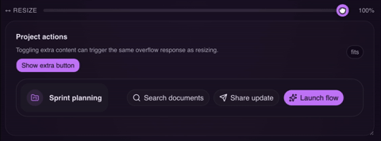

<p align="center">
  
</p>

# `<OverflowGuard>`

Build around content, not breakpoints.

Overflow Guard helps React UI adapt when content stops fitting, instead of guessing with viewport breakpoints or magic pixel values.

It is built for content-aware responsiveness: toolbars that collapse to icons, navs that switch to a menu, and fixed-height areas that reveal a "Read more" action only when they actually overflow.



Repository: <https://github.com/arturmarc/overflow-guard>
Website: <https://overflow-guard.vercel.app/>

## Libraries

- [`overflow-guard-react`](./packages/overflow-guard-react/README.md): React package for content-aware responsive UI
- [`overflow-guard-html`](./packages/overflow-guard-html/README.md): HTML/custom element package readme

## Commands

```sh
bun install
bun run build
bun run test
```
