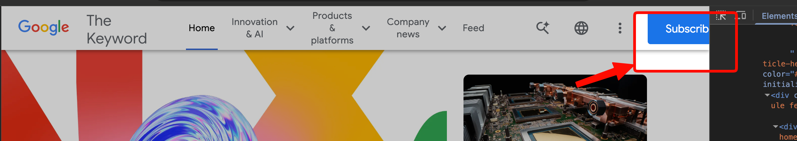
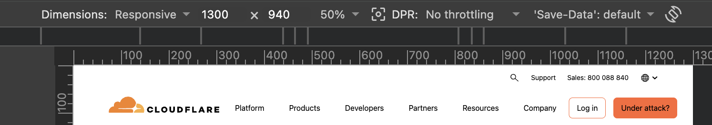
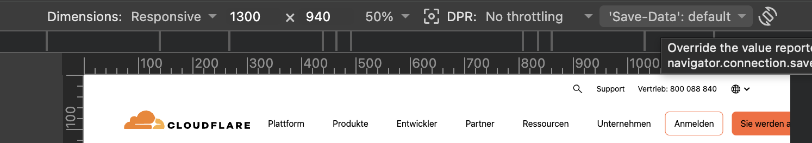
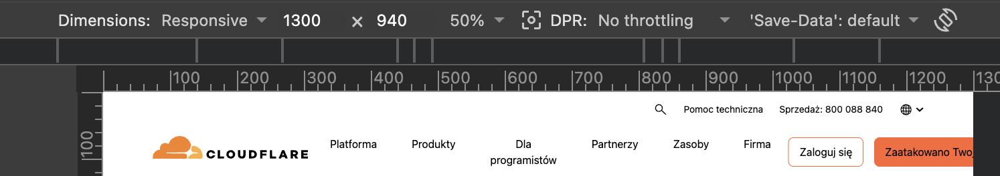

# Responsive Toolbars and Navbars, Done Right

## Look ma, no media queries!

Responsive design is basically solved nowadays, right? We've been doing media queries for over a decade, we have `@container` queries now, and we have cool tricks like CSS Grid's `repeat(auto-fit, minmax())`.
All this works pretty well, especially when things are static. But if you are dealing with dynamic content, things can still get less than perfect 😅. It's especially easy to trip over toolbars, even for the pros:

### Common failures:

| site with dynamic navbar                                                                                       | goes wrong 🥺                                                                                                                                                                                                                                                                                           |
| -------------------------------------------------------------------------------------------------------------- | ------------------------------------------------------------------------------------------------------------------------------------------------------------------------------------------------------------------------------------------------------------------------------------------------------- |
| [blog.google at 1025px](https://blog.google/) 😥                                                               |                                                                                                                                                                                      |
| [cloudflare.com](https://www.cloudflare.com/) English is fine, but German or Polish not so much 😭             |    |
| [OpenAI docs below 820px wide](https://developers.openai.com/api/doc) are not even dynamic, and still break 🤮 |                                                                                                                                                                                                     |

This happens because you can't really solve this when there is dynamic content using pure CSS, where you have to rely on fixed pixel breakpoints.
To solve it correctly and robustly, you're gonna need some JS, or smart tools 🤓

The way to fix all of those is to detect when those navbars overflow. It's actually not that difficult, and a competent AI agent can whip up some [HTML+JS](https://codepen.io/arturmarc/pen/JoRaaqP) or [React](https://stackblitz.com/edit/responive-navbar-react-ai?file=src%2FResponsiveNav.tsx) code.

### OverflowGuard to the rescue 🛟

And you can stop here and call it a day, I guess 🤷‍♂️. But we can make this even easier by using a smart tool: **OverflowGuard**.
It does exactly what it says on the tin 🏷️: it detects overflow and lets you swap in alternative styles or content.
It has two flavors:

- **[Pure HTML version 💎](https://overflow-guard.vercel.app/html)**:
  a custom element, useful when doing vanilla HTML or using frameworks like Astro. See [the same example built with it](https://codepen.io/arturmarc/pen/gbwdBgG) (notice no JS anymore 😉)
- **[React component](https://overflow-guard.vercel.app/react)**:
  makes it trivial to adopt this kind of responsiveness, as you can see in the [adjusted React example](https://stackblitz.com/edit/responive-navbar-react-overflow-guard?file=src%2FResponsiveNav.tsx)

Navbars are just the most common example. Other use cases you might easily find:

### Removing labels from buttons

That’s a useful way to keep a toolbar compact when horizontal space gets tight. Toolbars with buttons are notoriously dynamic (translations, permissions, other context), so it's sometimes impossible to find good hard-coded breakpoints.

Check out a [HTML example](https://codepen.io/arturmarc/pen/JoRgmeE), and a [React example](https://stackblitz.com/edit/vitejs-vite-hxtayrqh?file=src%2FResizableHarness.tsx,src%2FApp.tsx,src%2Fstyles.css&terminal=dev)

### "Read more..."

Let’s not limit ourselves to the horizontal. OverflowGuard works perfectly well in the vertical ↕️ direction. Here's something you might want to do: set a max height on a box and show a "read more" button if the content inside overflows.
Again, this is easily doable in [HTML](https://codepen.io/arturmarc/pen/zxKgXra) or [React](https://stackblitz.com/edit/vitejs-vite-wedfqtkt?file=package.json,vite.config.ts,src%2Fmain.tsx,src%2FApp.tsx,src%2Fstyles.css,src%2Fvisuals.tsx,src%2FResizableHarness.tsx&terminal=dev).


### A "greedy nav" 🧭 🍽️

Leaving the best for last: a robust pattern for dynamic navbars called "greedy nav", which you can find, for example, on another [Google page](https://developer.chrome.com/) that actually works correctly 😉.
You can nest OverflowGuard, so it's quite easy to use it to build a greedy nav, especially in [React](https://stackblitz.com/edit/vitejs-vite-ydwytwhk?file=src%2FApp.tsx).
It's doable in [raw HTML](https://codepen.io/arturmarc/pen/bNwXJXY) too, if you're OK with all the extra nesting 😅 (still accessible, notably), or by adding [some extra JS](https://codepen.io/arturmarc/pen/dPpxEgR).

### Give it a go 🏃

Once you have **[OverflowGuard](https://overflow-guard.vercel.app/)** in your toolbag, I am sure it will unlock some cool tricks 🪄 you never thought could be so easy to implement. Also mention it to your designers 🎨. They often work in fixed breakpoints 🙄, but with this capability they can lean into more fluid and content-driven design.

### Ways to get started

```sh
bun add overflow-guard-react
```

```sh
bun add overflow-guard-html
```

Or drop the custom element straight into a no-build page:

```html
<script src="https://cdn.jsdelivr.net/npm/overflow-guard-html@0"></script>
```

If you want your AI agent to know how to use the library, install the package-specific skill too:

```sh
npx skills add https://github.com/arturmarc/overflow-guard/tree/main/packages/overflow-guard-react --skill overflow-guard-react
```

```sh
npx skills add https://github.com/arturmarc/overflow-guard/tree/main/packages/overflow-guard-html --skill overflow-guard-html
```
